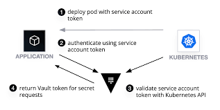
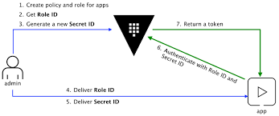

# Vault Secret Plugin


[](https://app.codacy.com/manual/akhettar/vault-secrets-loader?utm_source=github.com&utm_medium=referral&utm_content=akhettar/vault-secrets-loader&utm_campaign=Badge_Grade_Dashboard)
[](https://goreportcard.com/report/github.com/akhettar/vault-secrets-loader)
[](https://codecov.io/gh/akhettar/vault-secrets-loader)
[](https://godoc.org/github.com/akhettar/vault-secrets-loader)


 


This vault plugin is used to load secrets from the vault server into memory at the start of the service. The secrets then can be accessed from memeory at runtime. This library has been inspired from [the Spring Vault Cloud](https://cloud.spring.io/spring-cloud-vault/reference/html/#vault.config.backends) by which a microservice or an application loads its secrets
from the vault server at the startup. So the secrets are loaded once into the memory and are accessible throughout the application lifecycle.

## Usage
This library supports two types of vault authentication methods: `Kubernetes` and `App role` - see below more details on how to instantiate an instance of the vault client

Here is an example of the client can be used in app

`The service or the app vault config should look like the following`

```yaml
auth_method: KUBERNETES
token: data/token
role: example_role
secret_path: secret/data/app/config
address: http://localhost:8080
role_id: 62022d0a-b316-30cb-8265-b37da6763012 \
secret_id: f4a9312b-118c-8d28-fbff-5661760e8a58
tls_config:
  ca_cert: eyJhbGciOiJSUzI1NiIsImtpZCI6IjZMNUxjVG1tU
  ca_path: /var/ca
  client_cert: eyJhbGciOiJSUzI1NiIsImtpZCI6IjZMNUxjVG1tU
  client_key: eyJhbGciOiJSUzI1NiIsImtpZCI6IjZMNUxjVG1tU
  tls_server_name: name
  insecure: false
```


`Kubernetes auth method`

`With config file`
```go
package main

import (
	"fmt"
    "github.com/akhettar/vault-secrets-loader"
)

func main() {

    // Create a client by login into vault and read all the secrets into memory
	client, err := vault.NewClient("config/config.yml")
	if err != nil {
		vault.Error.Fatalf("Failed %v", err)
	}

	// read secret - this read from memory
	pwd := client.ReadSecret("password")
	vault.Info.Printf("Password is %s", pwd)
}
```

`With Config`
```go
package main

import (
	"fmt"
    "github.com/akhettar/vault-secrets-loader"
)

func main() {
    // TLS config - if tls is not enabled, this config can be ignored
    tlsConfig := vault.TLSConfig{CAPath:"<root-ca>", ClientCert:"<public-key>", ClientKey:"<private-key>"}
   	
	// create config
    config := vault.Config{
                Address: vault_addr,
                Role: "example",
                SecretPath: "secret/data/myapp/config",
                AuthMethod: vault.KubernetesAuth,
                Token: "<kube-token>", // this can be sourced from /var/run/secrets/kubernetes.io/serviceaccount/token
                TLSConfig:tlsConfig}

    // Create a client by login into vault and read all the secrets into memory
	client, err := vault.NewClientWithConfig(config)
	if err != nil {
		vault.Error.Fatalf("Failed %v", err)
	}

	// read secret - this read from memory
	pwd := client.ReadSecret("password")
	vault.Info.Printf("Password is %s", pwd)
}
```

`App role auth method`

```go
package main

import (

"fmt"
"github.com/akhettar/vault-secrets-loader"

)

func main() {
    // TLS config - if tls is not enabled, this config can be ignored
    tlsConfig := vault.TLSConfig{CAPath:"<root-ca>", ClientCert:"<public-key>", ClientKey:"<private-key>"}
   	
	// create config
    config := vault.Config{
                Address: vault_addr,
                SecretPath: "secret/data/myapp/config",
                AuthMethod: vault.AppRoleAuth,
                SecretId:"056a8b44-8473-e7d1-f76b-af86144fcabe",
                RoleId:"62022d0a-b316-30cb-8265-b37da6763012", 
                TLSConfig: tlsConfig}}

    // Create a client by login into vault and read all the secrets into memory
	client, err := vault.NewClientWithConfig(config)
	if err != nil {
		vault.Error.Fatalf("Failed %v", err)
	}

	// read secret - this read from memory
	pwd := client.ReadSecret("password")
	vault.Info.Printf("Password is %s", pwd)
}
```

## Configuration parameters for the plugin

These are the environment variables required for this tool. 

| Configuration parameter | Description                                         | Required  |
| ----------------------- |-------------------------------------------------    | ----------|
| `Address`               | The vault address, exp: https://192.168.1.35:1234   | Yes       |
| `Role`                  | The role name chosen for the service account        | Yes, only for `kube auth method`   |
| `SecretPath`            | The secret path where to source all the secret from for a given service                | Yes  |
| `SecretPath`            | The secret path where to source all the secret from for a given service                | Yes  |
| `Token`                 | The kube token path, normally present here: /var/run/secrets/kubernetes.io/serviceaccount/token  | Yes  |
| `SecretId`              | The secretId for the role app auth  | Yes, only for `role app auth` method |
| `RoleId`                | The role Id for the role app auth   | Yes, only for the `role app auth` method   |
| `CAPath`                | the Vault server SSL certificate   | Yes, if tls connection is enabled   |
| `ClientCert`            | ClientCert is the path to the certificate for Vault communication   | Yes, if tls connection is enabled   |
| `ClientKey`             | ClientKey is the path to the private key for Vault communication   | Optional, if tls connection is enabled   |
| `TLSServerName`         | TLSServerName, if set, is used to set the SNI host when connecting via   | Optional, if tls connection is enabled   |
| `Insecure`              | Insecure enables or disables SSL verification   | Optional, if tls connection is enabled   |

## Authentication Method

This library supports two type of authentication methods:

### 1. Kubernetes auth method



This is the case where a REST service is deployed to kubernetes cluster, a service account is configured for the pod, which provides an identity for processes that run in a Pod so that the processes can contact the API server.
When the pod is created a temporary token is created in the following file system of the docker container on which the pod is running on: `/var/run/secrets/kubernetes.io/serviceaccount/token`. A learning harshicrop blog on how to enable `kubernetes` auth and test the authentication locally can be found here: [Vault Agent with kubernetes](https://learn.hashicorp.com/vault/identity-access-management/vault-agent-k8s#step-2-configure-kubernetes-auth-method)
See also [Kubernetes auth method](https://www.vaultproject.io/docs/auth/kubernetes/)

### 1. App role auth method



The `approle` auth method allows machines or apps to authenticate with `vault-defined roles`. Details on how to enable `app role` auth and how to set it up can be found [Vault project documentation](https://www.vaultproject.io/docs/auth/approle/)

# License
[MIT](LICENSE)


